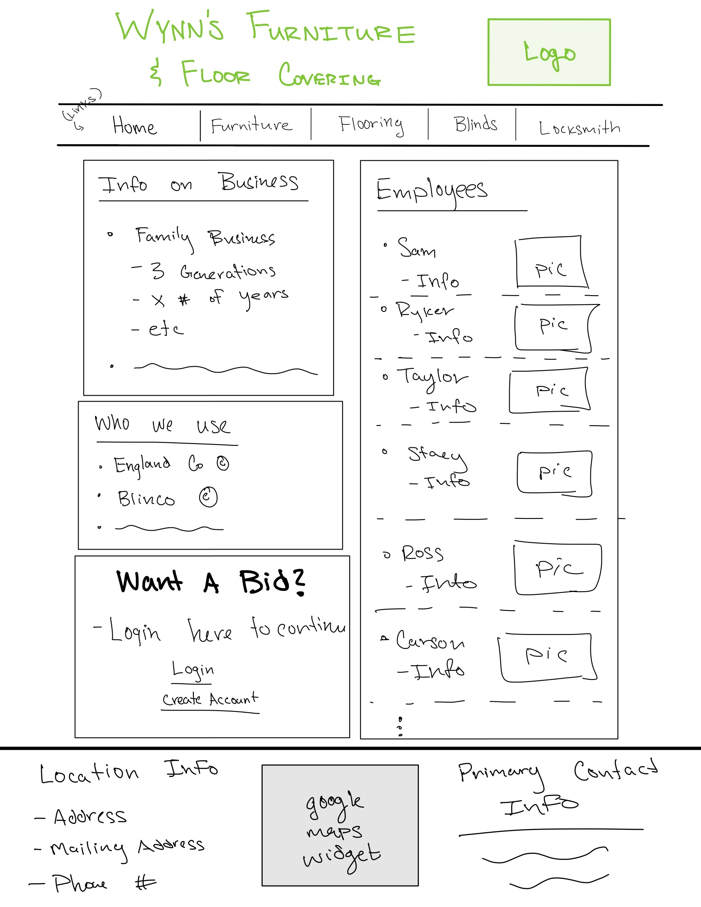

# Wynn's Flooring and Home Furnishings
## Links
- [Startup Specification](#startup-specification)
- [HTML Updates](#html-updates)
## Startup Specification
### Links
1. [Elevator Pitch](#elevator-pitch)
2. [Key Feature](#key-features)
3. [Technologies](#technologies)
4. [Images](#images)
### Elevator Pitch
Having a simple, helpful, intuitive website for a business is an essential feature. Websites should not be too cluttered or confusing to navigate.\
\
The goal of this project is to turn an old, crumby, miserable website into a new, highly intuite asset for the business. The business this service will be done for is *Wynn's Furniture and Floor Covering*. This is a family business that has been in my family for three generations. The old website was created by a 3rd party with almost no imput for the owner.\
\
I will completely scrap the old website and create a brand new, improved website for this project.
### Key Features
- Login to request bid or to order furniture
- User information is stored so they can easily return for another bid/purchase
- Multiple links to easily seperate each of the services provided by the business
- Allow for simple contact to and from customer
### Technologies
- [HTML](#html-deliverables) - Create the structure of the document, include all the necessary links and information
- [CSS](#css) - Make the website easy to read and clean
- [JavaScript](#javascript-deliverables) - Allows for the login as well as requesting to buy furniture
- [Service](#service-deliverables) - Backend services that allow for
    - Login
    - Request Bid
    - Purchasing
    - Contact Info to be reached at
- [DB](#db-deliverables) - Store user data and contact info
- [Login](#login-deliverables) - Register and login users, secure all info
- [WebSocket](#websocket-deliverables) - Allows for possible instant instant chat with employees
- [React](#react-deliverables) - Application ported
#### HTML Deliverables
- HTML will be used to properly setup the structure of the startup
    - Business name and Logo will stay at top of screen
    - Links for four pages will be included
        1. Home
        2. Furniture
        3. Floor Coverings
        4. Window Coverings and Blinds
        5. Mattress Needs
    - A descirption of the business and some fun facts will be on the home page
    - A brief description of employees and pictures will be used to make it feel more friendly and open
    - There will be a short section on the suppliers we use and why they (and we) are trustworthy
    - There will be a place where they can request a bid (flooring or blinds) or request to purchase a furniture item
    - The footer will include Location info, primary contact info, and a google maps widget that allows people to see our location on a map
#### CSS Deliverables
- CSS is necessary to make the website look clean, desirable, and making people want to visit again
    - Seperate the header and footer and main body so we can make the website organized and clean
    - This will not only work on desktops, but the CSS will allow the users to experience an enjoyable experience on mobile systems as well
    - All links will work properly and look clean and in place
#### JavaScript Deliverables
- JavaScript will allow the users to interact with the website, which is essential to many features
    - Requesting a bid/purchase
    - Login information is saved
    - Any other logic in the application
#### Service Deliverables
- This is important to many features
    - Login information
    - Purchasing an item or requesting a bid
    - Giving clients our contact information and vice versa
#### DB Deliverables
- This is essential to safely store the users data
    - Login username and passwords
    - Clients preferances
    - Requests for bids
    - Requests for purchases and their order
#### Login Deliverables
- I will simply keep track of user's data so they can accuratly access their own information every time
    - Create new accounts
    - Returning users
    - Guest option
#### WebSocket Deliverables
- This technology will information to be readily available to the use
    - Allow the business owners to posisbly respond to chats in real time
    - Allow the google maps to stay updated and active
#### React Deliverables
- Using React will allow m eto multiple items
    - Bundle packages
    - Allow to keep my code in components
    - Route the login info to the other components
### Images

*Sketched Design*

---

## HTML Updates

---

[**Return To Top**](#startup-company-exmaple)
